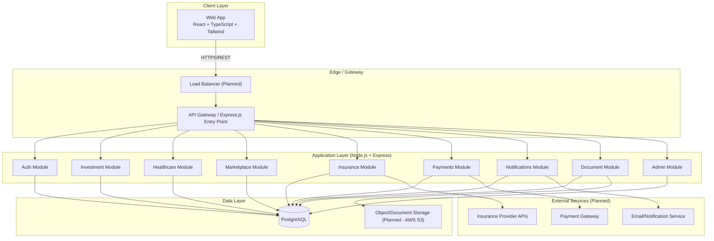
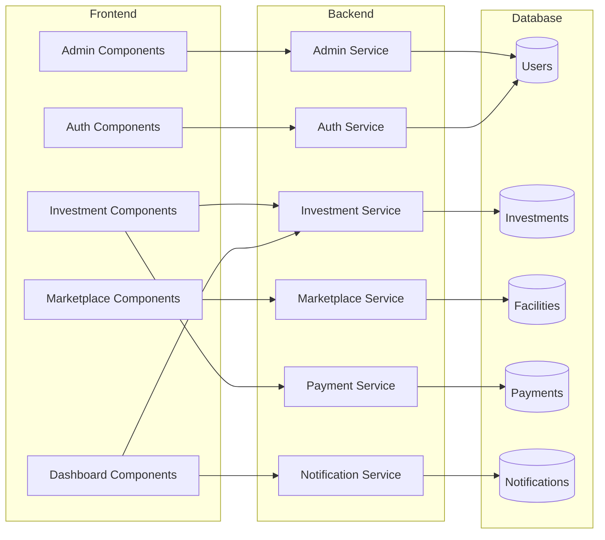
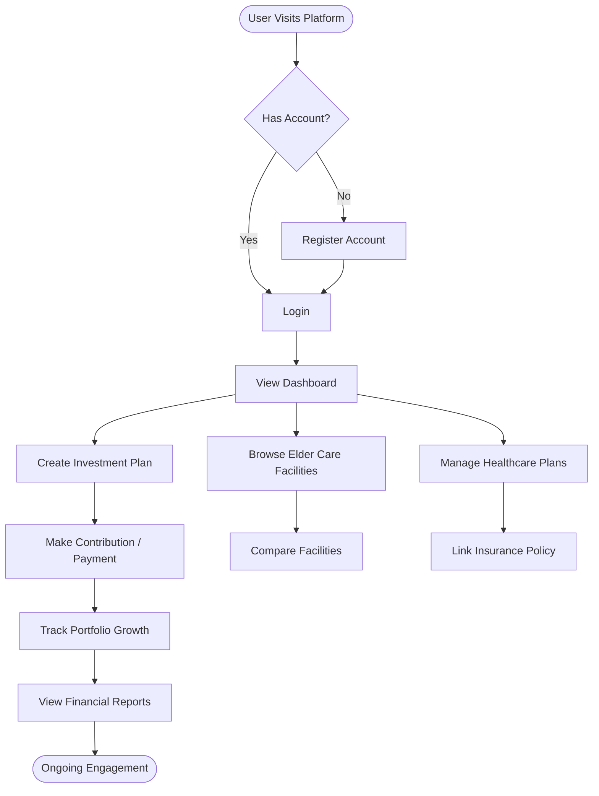
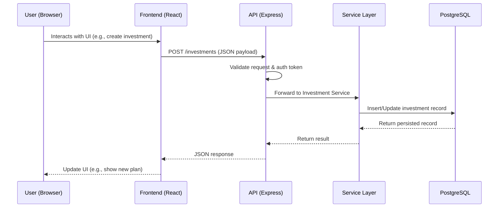
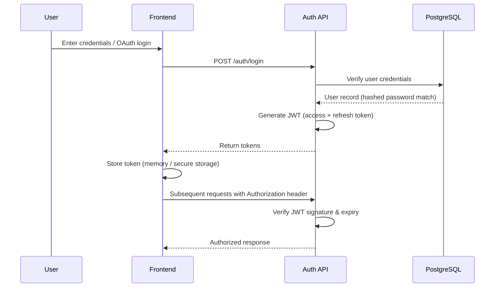
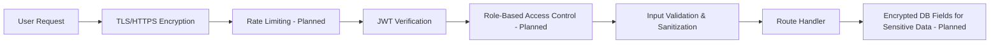
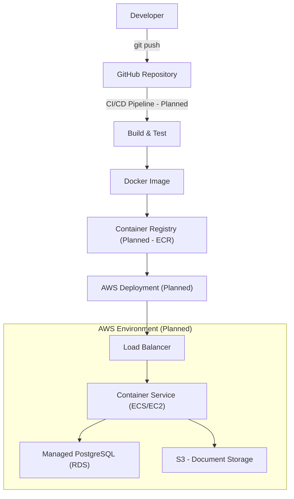
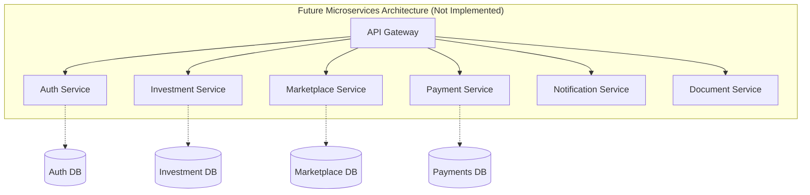
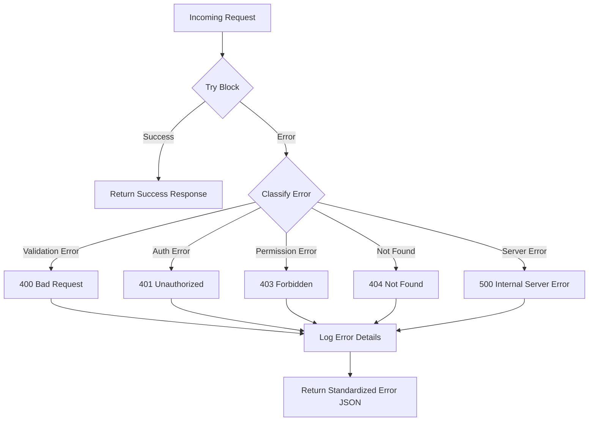

<div align="center">

# 🏛️ ElderCare-Invest — System Architecture

**A comprehensive architectural blueprint for a fintech + healthtech elder care investment platform.**

[](#-1-system-overview)
[-blue)](#-3-layered-architecture)

</div>

> ⚠️ **Document Status:** This architecture document describes the **planned** design for ElderCare-Invest. The project is currently in the **Planning Phase** — no backend, frontend, or database components have been implemented yet. Every diagram and section below represents an architectural intent, not existing infrastructure.

---

## 📑 Table of Contents

1. [System Overview](#-1-system-overview)
2. [High-Level Architecture](#-2-high-level-architecture)
3. [Layered Architecture](#-3-layered-architecture)
4. [Component Diagram](#-4-component-diagram)
5. [User Flow](#-5-user-flow)
6. [Data Flow](#-6-data-flow)
7. [Authentication Flow](#-7-authentication-flow)
8. [Database Communication](#-8-database-communication)
9. [Backend Modules](#-9-backend-modules)
10. [Frontend Modules](#-10-frontend-modules)
11. [API Layer](#-11-api-layer)
12. [Security Architecture](#-12-security-architecture)
13. [Deployment Architecture](#-13-deployment-architecture)
14. [Scalability Strategy](#-14-scalability-strategy)
15. [Future Microservice Architecture](#-15-future-microservice-architecture)
16. [Logging & Monitoring](#-16-logging--monitoring)
17. [Error Handling Strategy](#-17-error-handling-strategy)
18. [File Structure](#-18-file-structure)
19. [Technology Decisions](#-19-technology-decisions)
20. [Design Principles](#-20-design-principles)
21. [Architecture Decisions](#-21-architecture-decisions)
22. [Future Improvements](#-22-future-improvements)

---

## 🧭 1. System Overview

ElderCare-Invest is designed as a **modular monolith** for its initial release (v1.0), with a clear internal service boundary structure that allows a future transition to microservices as the platform scales.

| Attribute | Description |
|---|---|
| **Architecture Style** | Modular monolith (Planned) → Microservices (Future) |
| **Primary Domains** | Authentication, Investments, Healthcare, Marketplace, Insurance, Payments, Notifications, Documents, Admin |
| **Client Type** | Single-page web application (SPA) |
| **API Style** | RESTful JSON API |
| **Data Store** | PostgreSQL (relational) |
| **Deployment Target** | Docker containers on AWS |

The system is designed around a **decades-long user relationship** — users may interact with the platform for 20–40 years as they invest toward elder care. This drives architectural priorities toward **data integrity, auditability, and long-term maintainability** over raw throughput.

---

## 🏗️ 2. High-Level Architecture



> 📌 All modules currently run within a single Express.js application (modular monolith). External integrations (payment gateway, insurance APIs, email service) are **planned** and not yet selected/implemented.

---

## 🧱 3. Layered Architecture

The backend follows a classic **layered (n-tier) architecture** to keep business logic decoupled from HTTP and data-access concerns.

```
┌──────────────────────────────────────────────┐
│               Presentation Layer               │
│   (React Components, Pages, Hooks, Routing)     │
└────────────────────────┬─────────────────────┘
                          │ REST / JSON over HTTPS
┌────────────────────────▼─────────────────────┐
│                  API / Route Layer              │
│   (Express Routers, Request Validation, DTOs)   │
└────────────────────────┬─────────────────────┘
                          │
┌────────────────────────▼─────────────────────┐
│               Controller Layer                  │
│   (Request handling, response shaping)          │
└────────────────────────┬─────────────────────┘
                          │
┌────────────────────────▼─────────────────────┐
│                Service / Business Layer         │
│   (Core domain logic: investments, auth, etc.)  │
└────────────────────────┬─────────────────────┘
                          │
┌────────────────────────▼─────────────────────┐
│              Data Access Layer (Repository)     │
│   (Query building, ORM/DB queries)              │
└────────────────────────┬─────────────────────┘
                          │
┌────────────────────────▼─────────────────────┐
│                PostgreSQL Database              │
└──────────────────────────────────────────────┘
```

| Layer | Responsibility | Status |
|---|---|---|
| Presentation | UI rendering, client-side state, routing | Planned |
| API/Route | Request parsing, input validation | Planned |
| Controller | Orchestrates request → service calls | Planned |
| Service/Business | Core domain logic and rules | Planned |
| Data Access | Database queries, transactions | Planned |
| Database | Persistent storage | Planned |

---

## 🧩 4. Component Diagram



All components above are **planned**; none currently exist as working code.

---

## 🚶 5. User Flow



This represents the **intended** end-to-end user journey once the MVP is built.

---

## 🔄 6. Data Flow



> This sequence is representative of the **planned** request lifecycle for any core feature (investments, healthcare, marketplace, etc.).

---

## 🔐 7. Authentication Flow



**Planned authentication strategy:**

| Mechanism | Purpose | Status |
|---|---|---|
| JWT (Access Token) | Short-lived session authorization | Planned |
| JWT (Refresh Token) | Long-lived session renewal | Planned |
| OAuth 2.0 | Third-party login (Google, etc.) | Planned |
| Password Hashing (bcrypt/argon2) | Secure credential storage | Planned |

---

## 🗄️ 8. Database Communication

```
┌────────────────────┐        ┌─────────────────────────┐        ┌────────────────┐
│   Service Layer      │ ────▶ │  Data Access / Repository │ ────▶ │   PostgreSQL     │
│ (business logic)     │ ◀──── │  (query builder / ORM)    │ ◀──── │   Database       │
└────────────────────┘        └─────────────────────────┘        └────────────────┘
```

- The Service Layer **never queries the database directly** — all queries go through a Data Access/Repository layer to keep business logic testable and DB-agnostic.
- Connection pooling will be used to manage concurrent database connections efficiently (Planned).
- Transactions will wrap multi-step operations (e.g., creating an investment + initial payment record) to ensure data consistency (Planned).

---

## ⚙️ 9. Backend Modules

| Module | Responsibility | Status |
|---|---|---|
| **Auth Module** | Registration, login, JWT/OAuth, session management | Planned |
| **Investment Module** | Investment plan creation, contributions, portfolio tracking | Planned |
| **Healthcare Module** | Healthcare plan management | Planned |
| **Marketplace Module** | Elder care facility listings & comparison | Planned |
| **Insurance Module** | Insurance provider linking & policy management | Planned |
| **Payments Module** | Payment processing, transaction history | Planned |
| **Notifications Module** | Reminders, alerts, milestone notifications | Planned |
| **Document Module** | Secure document upload/storage/retrieval | Planned |
| **Admin Module** | User & provider management, platform oversight | Planned |
| **Reports Module** | Financial reports & analytics generation | Planned |

---

## 🎨 10. Frontend Modules

| Module | Responsibility | Status |
|---|---|---|
| **Auth Pages** | Login, registration, password reset | Planned |
| **Dashboard** | Overview of investments, healthcare, notifications | Planned |
| **Investment Portfolio** | Portfolio visualization, contribution management | Planned |
| **Savings Calculator** | Interactive retirement/elder care savings estimator | Planned |
| **Marketplace UI** | Browse/compare elder care facilities | Planned |
| **Healthcare & Insurance UI** | Manage plans and linked policies | Planned |
| **Document Center** | Upload/view secure documents | Planned |
| **Admin Panel** | Administrative controls and analytics | Planned |
| **Shared Components** | Buttons, forms, modals, layout, design system | Planned |

---

## 🔌 11. API Layer

The API layer will expose a **versioned RESTful interface** consumed exclusively by the frontend (and potentially partner integrations in the future).

**Planned conventions:**

| Convention | Standard |
|---|---|
| Base path | `/api/v1/` |
| Format | JSON |
| Auth header | `Authorization: Bearer <token>` |
| Pagination | `?page=&limit=` query params |
| Error format | `{ "success": false, "error": { "code": "...", "message": "..." } }` |
| Success format | `{ "success": true, "data": { ... } }` |

Example planned endpoint groups (see `docs/api-design.md` for full list):

```
/api/v1/auth/*
/api/v1/users/*
/api/v1/investments/*
/api/v1/healthcare-plans/*
/api/v1/facilities/*
/api/v1/insurance/*
/api/v1/payments/*
/api/v1/notifications/*
/api/v1/documents/*
/api/v1/admin/*
```

---

## 🛡️ 12. Security Architecture



| Layer | Control | Status |
|---|---|---|
| Transport | HTTPS/TLS everywhere | Planned |
| Authentication | JWT + OAuth | Planned |
| Authorization | Role-based access control (User/Admin) | Planned |
| Password Storage | bcrypt/argon2 hashing | Planned |
| Input Validation | Schema validation on all endpoints | Planned |
| Rate Limiting | Prevent brute-force/abuse | Planned |
| Data Encryption | Encryption at rest for sensitive fields & documents | Planned |
| Secrets Management | Environment variables, never committed to source | Planned |
| Dependency Scanning | Automated vulnerability checks (e.g., `npm audit`, Dependabot) | Planned |

> 🔒 Given the platform's financial and health-data nature, security controls will be treated as a first-class concern from Phase 9 (Security Review) onward — see `docs/roadmap.md`.

---

## 🚀 13. Deployment Architecture



| Component | Purpose | Status |
|---|---|---|
| Docker | Containerize frontend & backend | Planned |
| AWS ECS/EC2 | Application hosting | Planned |
| AWS RDS (PostgreSQL) | Managed database | Planned |
| AWS S3 | Document/file storage | Planned |
| AWS ALB | Load balancing | Planned |
| CI/CD (GitHub Actions) | Automated build/test/deploy pipeline | Planned |

---

## 📈 14. Scalability Strategy

| Concern | Planned Strategy |
|---|---|
| **Traffic growth** | Horizontal scaling of stateless backend containers behind a load balancer |
| **Database load** | Read replicas for PostgreSQL; connection pooling |
| **Static assets** | CDN distribution for frontend build assets |
| **File storage** | Offload documents to S3 rather than local/DB storage |
| **Caching** | Introduce a caching layer (e.g., Redis) for frequently read data (facility listings, reports) as usage grows |
| **Background jobs** | Move long-running tasks (report generation, notifications) to a queue-based worker system as load increases |

> None of the above are implemented yet — they represent the scaling path once real usage patterns emerge post-launch.

---

## 🧬 15. Future Microservice Architecture

While v1.0 ships as a modular monolith, module boundaries are being designed so they can be extracted into independent services later without a full rewrite.



| Trigger for Migration | Description |
|---|---|
| Team growth | Multiple teams needing independent deployability |
| Scaling bottlenecks | One module (e.g., Payments) needs to scale independently |
| Domain complexity | A module's logic grows complex enough to warrant isolation |

> 🧊 This is a **long-term, exploratory** direction — not a near-term commitment.

---

## 📊 16. Logging & Monitoring

| Concern | Planned Approach |
|---|---|
| **Application Logs** | Structured JSON logging (e.g., via Winston/Pino) |
| **Request Logging** | Log method, path, status, latency for each API call |
| **Error Tracking** | Centralized error tracking (e.g., Sentry) |
| **Infrastructure Monitoring** | AWS CloudWatch for resource metrics |
| **Uptime Monitoring** | External uptime checks on production endpoints |
| **Audit Logging** | Immutable audit trail for financial transactions and sensitive actions |

> No logging or monitoring infrastructure currently exists — all items above are planned for Phase 10 (Deployment) onward.

---

## 🧯 17. Error Handling Strategy



**Planned standardized error response:**

```json
{
  "success": false,
  "error": {
    "code": "VALIDATION_ERROR",
    "message": "Investment amount must be greater than zero."
  }
}
```

| Principle | Description |
|---|---|
| Centralized error middleware | All errors pass through one Express error-handling middleware |
| No leaking internals | Stack traces never exposed to clients in production |
| Consistent shape | Every error response follows the same JSON structure |
| Logged with context | Errors logged with request ID, user ID (if available), and timestamp |

---

## 📁 18. File Structure

```
ElderCare-Invest/
├── frontend/                 # React + TypeScript client (Planned)
│   ├── src/
│   │   ├── components/
│   │   ├── pages/
│   │   ├── hooks/
│   │   ├── services/         # API client calls
│   │   └── App.tsx
│   └── package.json
│
├── backend/                  # Node.js + Express server (Planned)
│   ├── src/
│   │   ├── controllers/
│   │   ├── routes/
│   │   ├── services/
│   │   ├── repositories/
│   │   ├── middleware/
│   │   └── index.ts
│   └── package.json
│
├── database/                 # Schema, migrations, seeds (Planned)
├── docs/                     # Project documentation
│   ├── project-idea.md
│   ├── requirements.md
│   ├── user-stories.md
│   ├── database-design.md
│   ├── api-design.md
│   ├── roadmap.md
│   └── architecture.md
├── assets/                   # Diagrams, images
├── scripts/                  # Automation/utility scripts
├── src/                      # Shared/core source code
├── tests/                    # Test suites (Planned)
├── docker-compose.yml
├── .env.example
├── .gitignore
├── LICENSE
└── README.md
```

> This structure reflects the current repository layout plus planned subfolders for code that has not yet been written.

---

## 🧠 19. Technology Decisions

| Decision | Choice | Rationale |
|---|---|---|
| Frontend Framework | React + TypeScript | Strong ecosystem, type safety, widely adopted for SPA development |
| Styling | Tailwind CSS | Utility-first styling for rapid, consistent UI development |
| Backend Runtime | Node.js + Express | JavaScript/TypeScript across the stack; mature, well-documented framework |
| Database | PostgreSQL | Strong relational integrity for financial data, ACID compliance, mature tooling |
| Auth | JWT + OAuth | Stateless auth suited to SPA + API architecture; OAuth enables social login |
| Containerization | Docker | Consistent environments across dev/staging/production |
| Cloud Provider | AWS | Mature managed services (RDS, S3, ECS) suitable for scaling a fintech platform |

---

## 🧩 20. Design Principles

- **Separation of Concerns** — each layer (presentation, API, business logic, data access) has a single, clear responsibility.
- **Domain-Oriented Modules** — backend code is organized around business domains (Investments, Healthcare, Marketplace) rather than technical type alone.
- **Security by Design** — sensitive data handling is considered at every layer, not bolted on afterward.
- **API-First** — the backend exposes a well-defined API contract, enabling the frontend (and future clients) to be built independently.
- **Fail Safely** — errors are handled explicitly and consistently; the system never silently swallows failures involving financial data.
- **Design for Change** — module boundaries anticipate a future microservices split without over-engineering the initial monolith.

---

## 📝 21. Architecture Decisions

> Recorded as lightweight Architecture Decision Records (ADRs) as key choices are made.

| ID | Decision | Status |
|---|---|---|
| ADR-001 | Start with a modular monolith rather than microservices for v1.0 | ✅ Decided |
| ADR-002 | Use PostgreSQL over NoSQL for core data, given relational/financial data needs | ✅ Decided |
| ADR-003 | Use JWT for stateless session management | ✅ Decided |
| ADR-004 | Defer payment gateway provider selection until Phase 7 (Integration) | ⬜ Pending |
| ADR-005 | Defer choice of caching layer (e.g., Redis) until scaling need is demonstrated | ⬜ Pending |
| ADR-006 | Defer microservice extraction until team/scale triggers are met | ⬜ Pending |

---

## 🔮 22. Future Improvements

- 🤖 AI-powered financial and elder care recommendation engine
- 📱 Native mobile applications (iOS & Android)
- 🧵 Event-driven architecture (message queue) for notifications and background processing
- 🗃️ Caching layer (Redis) for high-read endpoints (marketplace, reports)
- 🧬 Gradual extraction of high-load modules (e.g., Payments) into standalone services
- 🌐 Multi-region deployment for lower latency and higher availability
- 📡 Public/partner API for third-party healthcare and insurance integrations

---

<div align="center">

### 📍 This is a living architecture document

It will evolve as design decisions are finalized and implementation begins. Nothing described here should be assumed to exist in code until explicitly marked otherwise.

**ElderCare-Invest** — Architected for a lifetime, not just a launch.

</div>
