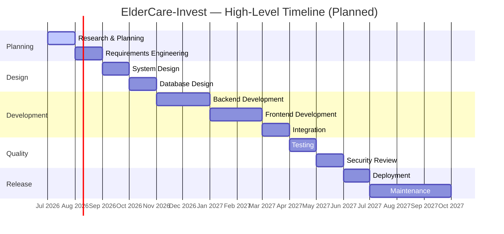

# 🗺️ ElderCare-Invest — Project Roadmap

**A phased, professional software development roadmap from planning to production.**

---

## 📌 Project Status

| Attribute | Value |
|---|---|
| **Current Phase** | Phase 1 — Research & Planning 🔵 In Progress |
| **Overall Progress** | ▓░░░░░░░░░░░░░░░░░░░ **5%** |
| **Development Model** | Agile (iterative, phase-gated) |
| **Team Size** | Solo founder / developer (portfolio project) |
| **Last Updated** | July 2026 |

> ⚠️ **Honesty Notice:** This roadmap reflects real progress only. No backend, frontend, or database work has been implemented yet. All phases beyond Phase 1 are **planned** and not started.

**Legend:**

| Symbol | Meaning |
|---|---|
| ✅ | Completed |
| 🔵 | In Progress |
| ⬜ | Planned / Not Started |
| 🧊 | Future / Stretch |

---

## 🧭 Development Philosophy

ElderCare-Invest follows the same disciplined lifecycle a professional software company would use to take a fintech/healthtech product from idea to production:

- **Documentation-first** — requirements, architecture, and data models are defined before code is written.
- **Iterative & Agile** — each phase produces a reviewable artifact (docs, diagrams, or working code) before the next begins.
- **Security & compliance-aware from day one** — especially critical given the platform handles financial and health-related data.
- **Incremental delivery** — an MVP ships before advanced features (AI recommendations, mobile apps) are attempted.
- **Transparency** — progress is tracked openly; nothing is marked "done" until it is verifiably done.

---

## 📅 Project Timeline

> 📌 Dates are **estimates** for planning purposes and will shift as the project progresses. This is a portfolio project developed part-time.

---

## 🏁 Milestones

| Milestone | Description | Status |
|---|---|---|
| 🏗️ M0 — Repository Initialized | Repo created, README, LICENSE, `.gitignore` published | ✅ Completed |
| 📋 M1 — Planning Complete | Project idea, problem/solution, and initial scope finalized | 🔵 In Progress |
| 📐 M2 — Requirements Signed Off | Functional & non-functional requirements finalized | ⬜ Planned |
| 🏛️ M3 — Architecture Approved | System design & database schema finalized | ⬜ Planned |
| ⚙️ M4 — Backend MVP | Core APIs functional (auth, investments, marketplace) | ⬜ Planned |
| 🎨 M5 — Frontend MVP | Core UI connected to backend APIs | ⬜ Planned |
| 🔗 M6 — Full Integration | Frontend + backend + database working end-to-end | ⬜ Planned |
| 🧪 M7 — QA Complete | Test coverage and bug triage complete | ⬜ Planned |
| 🔒 M8 — Security Reviewed | Security audit and hardening complete | ⬜ Planned |
| 🚀 M9 — v1.0 Launched | Public MVP deployed | ⬜ Planned |

---

## Phase 1 — Research & Planning 🔵 *In Progress*

**Goal:** Define the problem, the solution, and the initial project scope.

- [x] Define project concept and elevator pitch
- [x] Identify target users and stakeholders
- [x] Write problem statement & solution overview
- [x] Set up GitHub repository, README, LICENSE, `.gitignore`
- [ ] Conduct competitive/market research (existing fintech + elder care platforms)
- [ ] Validate assumptions with informal user feedback
- [ ] Finalize MVP scope boundaries

**Progress:** ▓▓▓▓▓▓▓▓▓▓░░░░░░░░░░ **50%**

---

## Phase 2 — Requirements Engineering ⬜ *Planned*

**Goal:** Translate the idea into concrete, testable requirements.

- [ ] Write full functional requirements document
- [ ] Write non-functional requirements (security, performance, scalability)
- [ ] Write user stories for all core features
- [ ] Define acceptance criteria for MVP features
- [ ] Prioritize features (MoSCoW or similar framework)

**Progress:** ░░░░░░░░░░░░░░░░░░░░ **0%**

---

## Phase 3 — System Design ⬜ *Planned*

**Goal:** Design the overall system architecture.

- [ ] Define high-level system architecture (client/server/services)
- [ ] Define API design conventions (REST standards, versioning, error format)
- [ ] Choose authentication strategy details (JWT + OAuth flow)
- [ ] Define service boundaries (Auth, Investment, Marketplace, Payments, etc.)
- [ ] Produce architecture diagrams

**Progress:** ░░░░░░░░░░░░░░░░░░░░ **0%**

---

## Phase 4 — Database Design ⬜ *Planned*

**Goal:** Design a normalized, scalable data model.

- [ ] Finalize entity list (Users, Investments, Transactions, Facilities, etc.)
- [ ] Design ER diagram with relationships
- [ ] Define schema (columns, types, constraints) for each table
- [ ] Plan indexing strategy for performance-critical queries
- [ ] Plan migration strategy

**Progress:** ░░░░░░░░░░░░░░░░░░░░ **0%**

---

## Phase 5 — Backend Development ⬜ *Planned*

**Goal:** Build the core server-side application.

- [ ] Project scaffolding (Node.js + Express + TypeScript config)
- [ ] Database connection & ORM/query layer setup
- [ ] Authentication module (register, login, JWT, OAuth)
- [ ] Investment management endpoints
- [ ] Healthcare plan management endpoints
- [ ] Elder care facility marketplace endpoints
- [ ] Insurance integration endpoints
- [ ] Payments module
- [ ] Notifications module
- [ ] Admin endpoints

**Progress:** ░░░░░░░░░░░░░░░░░░░░ **0%**

---

## Phase 6 — Frontend Development ⬜ *Planned*

**Goal:** Build the user-facing application.

- [ ] Project scaffolding (React + TypeScript + Tailwind CSS)
- [ ] Authentication pages (register/login)
- [ ] User dashboard
- [ ] Investment portfolio dashboard
- [ ] Retirement savings calculator UI
- [ ] Elder care facility marketplace UI
- [ ] Healthcare & insurance management UI
- [ ] Admin dashboard UI
- [ ] Responsive design pass

**Progress:** ░░░░░░░░░░░░░░░░░░░░ **0%**

---

## Phase 7 — Integration ⬜ *Planned*

**Goal:** Connect frontend, backend, and third-party services end-to-end.

- [ ] Connect frontend to backend APIs
- [ ] Integrate payment gateway (planned provider TBD)
- [ ] Integrate cloud file/document storage
- [ ] Integrate notification delivery (email/push, TBD)
- [ ] End-to-end smoke testing of core user flows

**Progress:** ░░░░░░░░░░░░░░░░░░░░ **0%**

---

## Phase 8 — Testing ⬜ *Planned*

**Goal:** Validate correctness, reliability, and usability.

- [ ] Unit tests for backend services
- [ ] Unit tests for frontend components
- [ ] Integration tests for API endpoints
- [ ] End-to-end tests for critical user journeys
- [ ] Manual QA pass & bug triage
- [ ] Performance/load testing

**Progress:** ░░░░░░░░░░░░░░░░░░░░ **0%**

---

## Phase 9 — Security Review ⬜ *Planned*

**Goal:** Harden the platform before handling real financial/health data.

- [ ] Dependency vulnerability scanning
- [ ] Authentication & authorization audit
- [ ] Input validation & injection testing
- [ ] Data encryption review (at rest & in transit)
- [ ] Secrets/environment variable management review
- [ ] Rate limiting & abuse prevention

**Progress:** ░░░░░░░░░░░░░░░░░░░░ **0%**

---

## Phase 10 — Deployment ⬜ *Planned*

**Goal:** Ship a stable, production-ready release.

- [ ] Containerize application with Docker
- [ ] Set up staging environment on AWS
- [ ] Set up production environment on AWS
- [ ] Configure CI/CD pipeline
- [ ] Set up monitoring, logging, and alerting
- [ ] Public v1.0 launch

**Progress:** ░░░░░░░░░░░░░░░░░░░░ **0%**

---

## Phase 11 — Maintenance ⬜ *Planned*

**Goal:** Keep the platform stable, secure, and evolving post-launch.

- [ ] Bug fix and patch release cycle
- [ ] Dependency and security updates
- [ ] User feedback collection process
- [ ] Performance monitoring and optimization
- [ ] Ongoing documentation updates

**Progress:** ░░░░░░░░░░░░░░░░░░░░ **0%**

---

## 🚀 Future Features

Features planned beyond the initial MVP release:

- 🤖 AI-powered financial and elder care recommendations
- 📱 Native mobile applications (iOS & Android)
- 🌐 Multi-language support
- 💱 Multi-currency support
- 🏢 Dedicated portals for elder care organizations and insurance providers
- 📡 Public/partner API for third-party integrations

## 🌟 Stretch Goals

Ambitious, longer-horizon ideas — not committed, exploratory only:

- 🧊 Predictive cost modeling using regional healthcare inflation data
- 🧊 Marketplace ratings/reviews system for elder care facilities
- 🧊 Family "shared plan" accounts for collaborative elder care funding
- 🧊 Integration with government retirement/pension schemes
- 🧊 Blockchain-based transparent audit trail for investment records

---

## 🧩 Version Roadmap

| Version | Focus | Key Deliverables | Status |
|---|---|---|---|
| **v1.0 — MVP** | Core platform launch | Auth, investment plans, portfolio dashboard, savings calculator, facility marketplace (basic), payments | ⬜ Planned |
| **v2.0 — Expansion** | Deeper ecosystem integration | Insurance integration, healthcare plan management, admin dashboard, notifications, document storage, financial reports | ⬜ Planned |
| **v3.0 — Intelligence & Scale** | Smart features & growth | AI-powered recommendations, mobile apps, multi-language/currency support, partner APIs | 🧊 Future |

---

## ✅ Success Criteria

The project will be considered successful at each stage if:

- **MVP (v1.0):** A user can register, create an investment plan, contribute funds, view portfolio growth, and browse elder care facilities — end-to-end, without critical bugs.
- **v2.0:** Users can manage healthcare plans and insurance policies alongside investments, and admins can manage the platform through a dedicated dashboard.
- **v3.0:** The platform provides personalized recommendations and is accessible via mobile, with a foundation for scaling to more users and partners.
- **Portfolio Goal:** The project demonstrates a complete, professional software development lifecycle — from documentation through deployment — suitable for technical review by recruiters and engineers.

---

## ⚠️ Risks and Challenges

| Risk | Impact | Mitigation |
|---|---|---|
| 🕐 **Solo development bandwidth** | Delays across all phases | Prioritize MVP scope tightly; defer non-essential features to v2.0/v3.0 |
| 🔐 **Handling sensitive financial/health data** | High — trust & compliance risk | Follow security best practices from Phase 9 onward; avoid storing real user data in the portfolio version |
| 🏦 **Payment gateway integration complexity** | Medium — could delay Phase 7 | Research and select a well-documented provider early; use sandbox/test modes |
| 🤝 **No real elder care/insurance partners** | Medium — marketplace data will be simulated | Clearly label marketplace data as sample/demo data in the portfolio version |
| 📈 **Scope creep** | Medium — could stall MVP delivery | Maintain strict phase-gated roadmap; move new ideas to "Future Features" or "Stretch Goals" |
| 🧪 **Limited testing resources as a solo dev** | Medium — risk of undetected bugs | Prioritize automated tests for critical flows (auth, payments, investments) |
| ☁️ **Cloud hosting costs** | Low–Medium | Use free-tier AWS services where possible during development |

---

### 📍 This roadmap is a living document

It will be updated as each phase progresses. Checkboxes, progress bars, and status labels are updated only when real, verifiable work is completed.

**ElderCare-Invest** — Building toward a future where elder care is planned, not panicked over.

