# Use Case Specification

## ElderNest – Future Elder Care Investment Platform

---

## 1. Introduction

This document defines the use cases for ElderNest, describing how each actor interacts with the system to achieve specific goals. Use cases are organized by module and mapped to the functional requirements defined in `requirements.md`. Each detailed specification includes actors, preconditions, main flow, alternate/exception flows, and postconditions.

---

## 2. Actors

| Actor | Type | Description |
|---|---|---|
| Investor | Primary (Human) | A registered user who creates and manages investment plans and books facility services. |
| Facility Manager | Primary (Human) | Represents an Elder Care Facility; manages availability, services, and bookings. |
| System Administrator | Primary (Human) | Oversees platform operations, verification, and compliance. |
| Family Member / Guardian | Secondary (Human) | Linked to an investor's account with configurable visibility/co-management permissions. |
| Payment Gateway | Secondary (System) | External system processing deposits, withdrawals, and recurring payments. |
| Financial Institution | Secondary (System) | External system managing and growing investment funds. |
| Healthcare Provider (Future) | Secondary (System) | External system supplying consented health data for care matching. |
| Notification Service | Supporting (System) | Internal/external system delivering email, SMS, and push notifications. |

---

## 3. Use Case Diagram (High-Level)

```mermaid
graph TD
    Investor((Investor))
    FacilityMgr((Facility Manager))
    Admin((System Administrator))
    Guardian((Family Member / Guardian))
    PaymentGW[[Payment Gateway]]
    FinInst[[Financial Institution]]
    Health[[Healthcare Provider - Future]]

    Investor --> UC1[Register / Login]
    Investor --> UC2[Manage Profile]
    Investor --> UC3[Create Investment Plan]
    Investor --> UC4[Make Contribution]
    Investor --> UC5[Use Retirement Calculator]
    Investor --> UC6[Search Facilities]
    Investor --> UC7[Book Facility]
    Investor --> UC8[View Transaction History]
    Investor --> UC9[Manage Health Profile]
    Investor --> UC10[Link Guardian]

    Guardian --> UC11[View Linked Investor Plan]
    Guardian --> UC12[Assist with Booking - if authorized]

    FacilityMgr --> UC13[Manage Facility Profile]
    FacilityMgr --> UC14[Update Availability]
    FacilityMgr --> UC15[Approve/Reject Booking]
    FacilityMgr --> UC16[Generate Facility Reports]

    Admin --> UC17[Verify Facility]
    Admin --> UC18[Manage User Accounts]
    Admin --> UC19[Review Flagged Transactions]
    Admin --> UC20[View Platform Analytics]
    Admin --> UC21[Configure Investment Plans]

    UC4 --> PaymentGW
    UC4 --> FinInst
    UC9 --> Health
```

---

## 4. Use Case List by Module

### 4.1 Authentication

| ID | Use Case | Primary Actor |
|---|---|---|
| UC-AUTH-01 | Register Account | Investor / Facility Manager |
| UC-AUTH-02 | Login | All Human Actors |
| UC-AUTH-03 | Reset Password | All Human Actors |
| UC-AUTH-04 | Enable Multi-Factor Authentication | Investor |

### 4.2 Profile Management

| ID | Use Case | Primary Actor |
|---|---|---|
| UC-PROF-01 | Update Personal Profile | Investor |
| UC-PROF-02 | Complete KYC Verification | Investor |
| UC-PROF-03 | Link Family Member / Guardian | Investor |
| UC-PROF-04 | View Linked Investor Plan | Family Member / Guardian |

### 4.3 Investment Management

| ID | Use Case | Primary Actor |
|---|---|---|
| UC-INV-01 | Browse Investment Plans | Investor |
| UC-INV-02 | Create Investment Plan | Investor |
| UC-INV-03 | Make Contribution | Investor |
| UC-INV-04 | View Investment Performance | Investor |
| UC-INV-05 | Request Plan Modification | Investor |
| UC-INV-06 | Approve Plan Modification | System Administrator |
| UC-INV-07 | Configure Investment Plan Offerings | System Administrator |

### 4.4 Retirement Planning

| ID | Use Case | Primary Actor |
|---|---|---|
| UC-RET-01 | Use Retirement Calculator | Investor |
| UC-RET-02 | Save Calculator Scenario | Investor |

### 4.5 Payments & Transactions

| ID | Use Case | Primary Actor |
|---|---|---|
| UC-PAY-01 | Process Payment | Investor / Payment Gateway |
| UC-PAY-02 | Retry Failed Payment | System (automated) |
| UC-PAY-03 | View Transaction History | Investor |
| UC-PAY-04 | Reconcile Transactions | System Administrator |
| UC-PAY-05 | Review Flagged Transaction | System Administrator |

### 4.6 Facility Management

| ID | Use Case | Primary Actor |
|---|---|---|
| UC-FAC-01 | Register Facility | Facility Manager |
| UC-FAC-02 | Verify Facility | System Administrator |
| UC-FAC-03 | Manage Facility Profile | Facility Manager |
| UC-FAC-04 | Update Room/Bed Availability | Facility Manager |

### 4.7 Facility Search & Booking

| ID | Use Case | Primary Actor |
|---|---|---|
| UC-BOOK-01 | Search Facilities | Investor |
| UC-BOOK-02 | Save/Favorite Facility | Investor |
| UC-BOOK-03 | Request Booking | Investor |
| UC-BOOK-04 | Approve/Reject Booking | Facility Manager |
| UC-BOOK-05 | Join Waitlist | Investor |
| UC-BOOK-06 | Cancel Booking | Investor |

### 4.8 Health Profile

| ID | Use Case | Primary Actor |
|---|---|---|
| UC-HEALTH-01 | Complete Health Profile | Investor |
| UC-HEALTH-02 | Share Health Profile with Facility | Investor |
| UC-HEALTH-03 | Sync Health Data (Future) | Healthcare Provider |

### 4.9 Notifications & Reporting

| ID | Use Case | Primary Actor |
|---|---|---|
| UC-NOTIF-01 | Configure Notification Preferences | All Human Actors |
| UC-REP-01 | Generate Account Statement | Investor |
| UC-REP-02 | Generate Facility Report | Facility Manager |
| UC-REP-03 | Generate Platform Report | System Administrator |

### 4.10 Administration

| ID | Use Case | Primary Actor |
|---|---|---|
| UC-ADMIN-01 | Manage User Accounts | System Administrator |
| UC-ADMIN-02 | View Platform Analytics | System Administrator |
| UC-ADMIN-03 | Suspend/Terminate Account | System Administrator |

---

## 5. Detailed Use Case Specifications

### UC-AUTH-01 — Register Account

- **Actor(s):** Investor, Facility Manager
- **Description:** A new user creates an account on the platform.
- **Preconditions:** The user does not already have an existing account with the provided email.
- **Main Flow:**
  1. User navigates to the registration screen.
  2. User provides email, password, and basic identity details.
  3. System validates input and checks for duplicate accounts.
  4. System sends a verification email/SMS.
  5. User confirms verification link/code.
  6. System activates the account.
- **Alternate Flows:**
  - 3a. Duplicate email detected → system displays an error and prompts login instead.
  - 5a. Verification not completed within 24 hours → account remains inactive; user may request a new verification link.
- **Postconditions:** A new, verified user account exists in the system with an assigned role.

---

### UC-AUTH-04 — Enable Multi-Factor Authentication

- **Actor(s):** Investor
- **Description:** An investor enables MFA to add a second layer of security to their account.
- **Preconditions:** User is logged in and has a verified account.
- **Main Flow:**
  1. User navigates to Security Settings.
  2. User selects "Enable MFA."
  3. System generates a setup code/QR for an authenticator app (or sends OTP via SMS).
  4. User confirms with a valid one-time code.
  5. System enables MFA and issues backup recovery codes.
- **Alternate Flows:**
  - 4a. Invalid code entered → system prompts retry; locks after repeated failures.
- **Postconditions:** MFA is required for all subsequent logins and high-risk actions on the account.

---

### UC-PROF-02 — Complete KYC Verification

- **Actor(s):** Investor
- **Description:** An investor submits identity documents required for regulatory compliance before making their first investment contribution.
- **Preconditions:** User has registered and verified their account.
- **Main Flow:**
  1. User is prompted to complete KYC before initiating an investment plan.
  2. User uploads a valid government-issued ID and proof of address.
  3. System performs automated document validation checks.
  4. System routes submission for administrator or automated third-party verification.
  5. System updates the user's KYC status to "Verified."
- **Alternate Flows:**
  - 3a. Document validation fails (poor quality, expired ID) → user is prompted to resubmit.
  - 4a. Verification is rejected → user is notified with reason and given the option to appeal or resubmit.
- **Postconditions:** Investor's account is marked as KYC-verified, unlocking investment plan creation.

---

### UC-INV-02 — Create Investment Plan

- **Actor(s):** Investor
- **Description:** An investor selects and activates an investment plan aligned with their elder care funding goals.
- **Preconditions:** Investor has completed KYC verification.
- **Main Flow:**
  1. Investor browses available investment plans (UC-INV-01).
  2. Investor selects a plan and reviews terms, projected returns, and fees.
  3. Investor sets contribution amount, frequency, and target maturity.
  4. System calculates and displays a projected growth summary.
  5. Investor confirms and links a payment method.
  6. System activates the plan and schedules the first contribution.
- **Alternate Flows:**
  - 5a. Payment method is invalid or declined → investor is prompted to provide an alternative method.
- **Postconditions:** A new active investment plan is created and linked to the investor's account.

---

### UC-INV-03 — Make Contribution

- **Actor(s):** Investor, Payment Gateway
- **Description:** An investor makes a scheduled or one-time contribution to an active investment plan.
- **Preconditions:** Investor has an active investment plan and a valid linked payment method.
- **Main Flow:**
  1. System (or investor manually) initiates a contribution per the plan schedule.
  2. System sends a transaction request to the Payment Gateway.
  3. Payment Gateway processes the transaction and returns a status.
  4. System updates the investment balance and transaction history.
  5. System sends a payment confirmation to the investor.
- **Alternate Flows:**
  - 3a. Payment fails → system logs the failure, notifies the investor, and schedules a retry (UC-PAY-02).
- **Postconditions:** The investment plan balance reflects the successful contribution, or a failure is logged for follow-up.

---

### UC-INV-05 / UC-INV-06 — Request & Approve Plan Modification

- **Actor(s):** Investor (requester), System Administrator (approver)
- **Description:** An investor requests a change to a matured investment plan's terms, which requires administrator approval.
- **Preconditions:** The investment plan has reached maturity.
- **Main Flow:**
  1. Investor submits a modification request (e.g., extend term, change withdrawal method).
  2. System routes the request to an administrator queue.
  3. Administrator reviews the request and supporting details.
  4. Administrator approves or rejects the request.
  5. System updates the plan status and notifies the investor of the outcome.
- **Alternate Flows:**
  - 4a. Request is rejected → investor is notified with a reason and may resubmit with corrections.
- **Postconditions:** The investment plan is updated per approved terms, or remains unchanged if rejected.

---

### UC-RET-01 — Use Retirement Calculator

- **Actor(s):** Investor (or prospective user, pre-registration)
- **Description:** A user estimates future elder care funding needs based on personal inputs.
- **Preconditions:** None (accessible to guests for exploration; saving requires an account).
- **Main Flow:**
  1. User inputs current age, target retirement age, and desired facility tier.
  2. System calculates estimated future cost and required contribution schedule.
  3. System displays a recommended investment plan matching the calculated needs.
  4. User may adjust inputs to explore alternative scenarios.
- **Alternate Flows:**
  - 4a. User wants to save the scenario → system prompts registration/login if not already authenticated (UC-RET-02).
- **Postconditions:** User receives a personalized funding estimate and, optionally, a saved scenario.

---

### UC-BOOK-01 — Search Facilities

- **Actor(s):** Investor
- **Description:** An investor searches for elder care facilities matching their preferences.
- **Preconditions:** None (search is available to all authenticated investors).
- **Main Flow:**
  1. Investor enters search criteria (location, service type, price range, availability).
  2. System queries verified, active facility listings.
  3. System returns matching results with ratings and key details.
  4. Investor filters, sorts, or refines the search.
- **Alternate Flows:**
  - 3a. No matching facilities found → system suggests broadening search criteria or joining a notification list for new matches.
- **Postconditions:** Investor views a list of facilities matching their criteria.

---

### UC-BOOK-03 — Request Booking

- **Actor(s):** Investor
- **Description:** An investor requests a booking at a facility using eligible investment funds.
- **Preconditions:** Investor has an eligible (matured or approved) investment balance and has selected a facility.
- **Main Flow:**
  1. Investor selects a facility and desired service/room tier.
  2. System verifies fund eligibility against the facility's booking criteria.
  3. Investor submits the booking request.
  4. System notifies the Facility Manager of the pending request.
  5. Facility Manager approves or rejects the request (UC-BOOK-04).
  6. System updates booking status and notifies the investor.
- **Alternate Flows:**
  - 2a. Insufficient eligible funds → system displays required shortfall and options (e.g., early-release request, top-up).
  - 5a. Facility rejects request → investor is notified and offered a waitlist option (UC-BOOK-05).
- **Postconditions:** A booking is confirmed, rejected, or placed on a waitlist.

---

### UC-BOOK-04 — Approve/Reject Booking

- **Actor(s):** Facility Manager
- **Description:** A facility manager reviews and responds to a pending booking request.
- **Preconditions:** A booking request exists in a pending state for the facility.
- **Main Flow:**
  1. Facility Manager reviews the booking request details (investor eligibility, requested tier, dates).
  2. Facility Manager checks current availability.
  3. Facility Manager approves or rejects the request, optionally providing a reason.
  4. System updates the booking status and notifies the investor.
- **Alternate Flows:**
  - 2a. No availability → Facility Manager may reject with an option to place the investor on a waitlist.
- **Postconditions:** Booking status is updated to Confirmed, Rejected, or Waitlisted.

---

### UC-HEALTH-02 — Share Health Profile with Facility

- **Actor(s):** Investor
- **Description:** An investor consents to share their health profile with a facility as part of a confirmed booking.
- **Preconditions:** Investor has completed a health profile and has a confirmed or pending booking.
- **Main Flow:**
  1. Investor is prompted to share health profile data as part of the booking process.
  2. Investor reviews what data will be shared and grants explicit consent.
  3. System transmits the consented data subset to the facility's authorized contact.
  4. System logs the consent event and data access for audit purposes.
- **Alternate Flows:**
  - 2a. Investor declines to share → booking proceeds without health data; facility may request it separately per its own policy.
- **Postconditions:** The facility gains access to the consented health data; an audit record is created.

---

### UC-FAC-02 — Verify Facility

- **Actor(s):** System Administrator
- **Description:** An administrator reviews and approves a newly registered facility before it becomes publicly visible.
- **Preconditions:** A facility has submitted registration details and supporting documentation.
- **Main Flow:**
  1. Administrator reviews submitted facility documentation (licensing, credentials, service details).
  2. Administrator verifies compliance with platform onboarding criteria.
  3. Administrator approves or rejects the facility registration.
  4. System updates facility visibility status and notifies the Facility Manager.
- **Alternate Flows:**
  - 3a. Registration rejected → Facility Manager is notified with the reason and may resubmit corrected documentation.
- **Postconditions:** Facility is marked as verified and publicly listed, or remains unverified/rejected.

---

### UC-PAY-05 — Review Flagged Transaction

- **Actor(s):** System Administrator
- **Description:** An administrator reviews a transaction flagged for exceeding compliance thresholds.
- **Preconditions:** A transaction has been automatically flagged by the system's AML monitoring rules.
- **Main Flow:**
  1. Administrator receives a flagged transaction in the compliance review queue.
  2. Administrator reviews transaction details, investor history, and supporting documentation.
  3. Administrator clears the transaction or escalates it for further investigation/regulatory reporting.
  4. System logs the review outcome and updates transaction status.
- **Alternate Flows:**
  - 3a. Transaction is escalated → account may be temporarily restricted pending resolution (per BR-012).
- **Postconditions:** The flagged transaction is resolved (cleared or escalated), with a full audit trail retained.

---

### UC-ADMIN-03 — Suspend/Terminate Account

- **Actor(s):** System Administrator
- **Description:** An administrator suspends or terminates a user or facility account for policy or compliance violations.
- **Preconditions:** Administrator has identified a violation requiring account action.
- **Main Flow:**
  1. Administrator locates the account via the admin dashboard.
  2. Administrator reviews violation details and history.
  3. Administrator selects suspend (temporary) or terminate (permanent) action, with a documented reason.
  4. System restricts or disables account access accordingly and notifies the affected user/facility.
- **Alternate Flows:**
  - 3a. Action is appealed by the user/facility → administrator may reverse the action following review.
- **Postconditions:** The account's access level reflects the administrator's decision, with the action logged for audit purposes.

---

## 6. Traceability Note

Each use case in this document maps to one or more functional requirements defined in `requirements.md` (e.g., UC-INV-02 → FR-013, FR-014; UC-BOOK-03 → FR-042, FR-045). This mapping should be maintained as both documents evolve to ensure consistency between requirements and system behavior.
